# Building a REST API in Node.js with Lambda and API Gateway using the web console

Welcome to second part of this series. Now we will build a REST API that will store candidate details into the DynamoDB. We will start by building a REST API using the AWS web console. Once we get the feel of how it is to work with web console we will use the Serverless framework to build the REST API.

## Prerequisite

To go through this tutorial you will need the following:

1. AWS account
2. Node.js
3. AWS CLI and have it configured

## Building a REST API using the web console

It's a two-step process to expose a REST API using AWS services:

1. Create an Amazon API Gateway that exposes resources and methods
2. Integrate the API Gateway with Amazon Lambda

### Step 1: Login to the AWS web console

Login to the AWS web console https://console.aws.amazon.com/console/home and select the [API Gateway service](https://console.aws.amazon.com/apigateway/home). If you don't have any API Gateways, then you will be presented with a greeting message. Click on the ***Get Started*** button.

### Step 2: Create a new API

Once you are inside the API Gateway editor, select ***New API***. The Amazon API Gateway supports multiple ways to create the API. If you have Swagger API definition files you can use them to create your service as well. The other way to create an API is to create an example API and then modify it to meet your use case. We will use the New API way because it allows us to configure all the options ourselves.

To create an API, you have to specify API name. We have specified ***Candidate Details*** as the API name. You can optionally specify a description. Once you have entered all the details you can press the ***Create API*** button.

### Step 3: Create `candidates` resource

After pressing ***Create API*** button, you will be inside the API Gateway editor that gives you all the capabilities to create an API. Click on Create Resource as shown below.

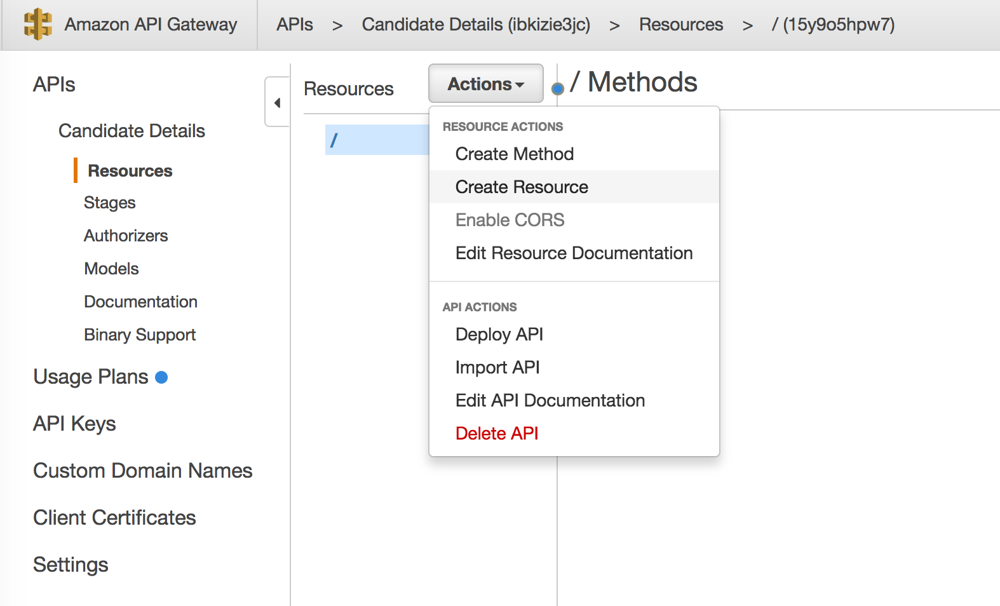

After selecting ***Create Resource***, you will be shown a form to provide details about the resource. Enter the information as shown below. Click on the ***Create Resource*** button after providing details.

After you press ***Create Resource***, you will find a `candidates` resource inside the root resource as shown below.

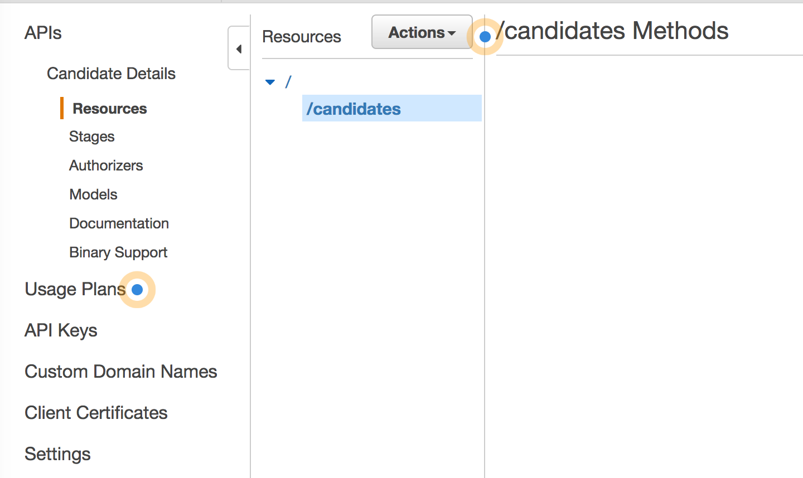

### Step 4: Create a `GET` method

Resources define the entities in your application. Now, you need to declare a method that you want to expose for this resource. We will create a `GET` method that will render all the candidates information. Click on ***Create Method*** as shown below.

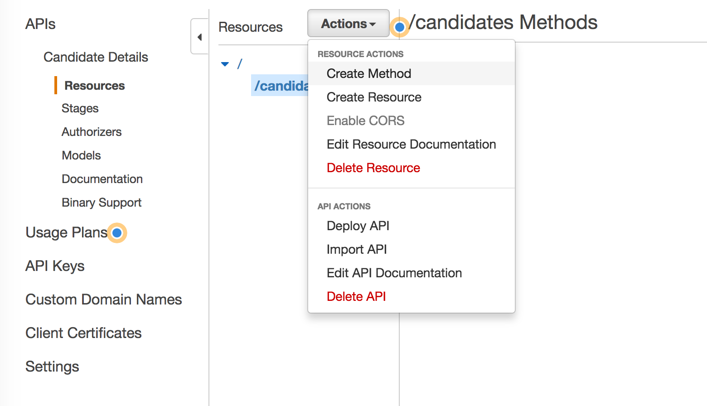

Next, select the GET method as shown below and press the tick mark button.

### Step 5: Setup an integration point for the `GET` method

Next, you will setup which service will back your `GET` method. Your API gateway can be backed by a lambda function, an existing HTTP backend, a mock response, any other AWS service like S3. We will use an Amazon Lambda backend.

If you don't have any lambda functions yet, you will be asked to create a one before continuing. Click on the ***Create a Lambda Function*** link. It will open the web page in a new tab so don't worry about loosing details.

### Step 6: Create a blank Node.js Lambda function

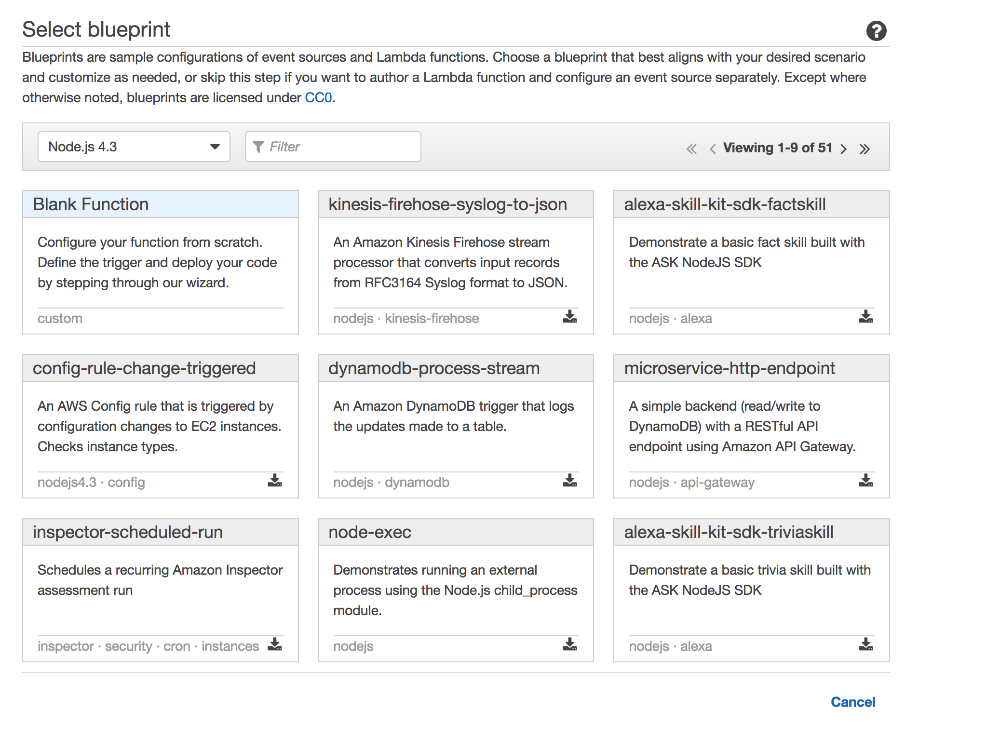

Select the _Blank Function_ blueprint and configure the function as shown below. We will leave it as it is.

Next, we will configure the function.

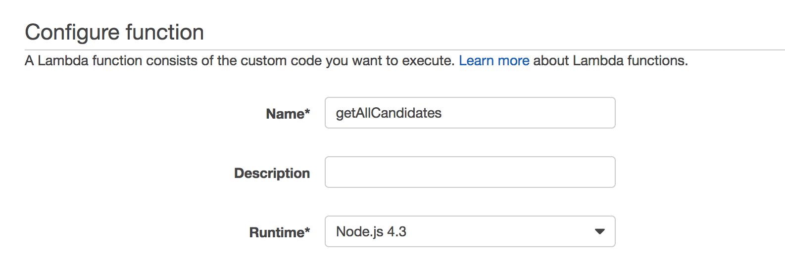

Change the inline code to match the one shown below.

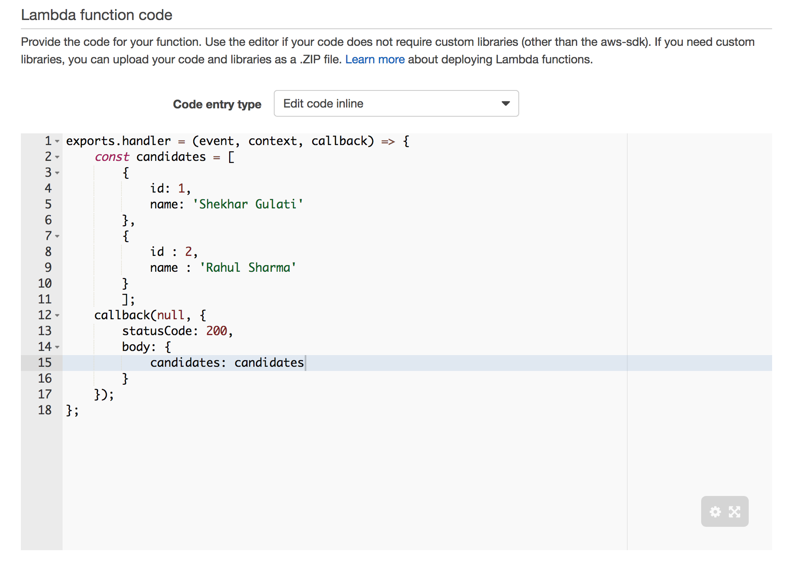

Next, we will configure the handler and role.

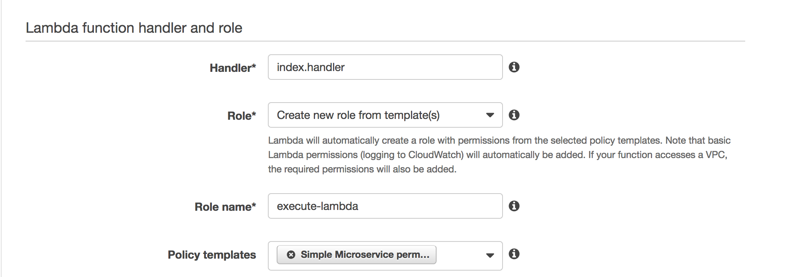

We will keep all other details the same and then save the function.

### Step 7: Update the API Gateway to use the Lambda function

Now that we have created our function we can configure the API Gateway to use our newly created lambda function.

Press the ***Save*** button after entering the details.

You will be asked to give permissions to the API Gateway to execute lambda function.

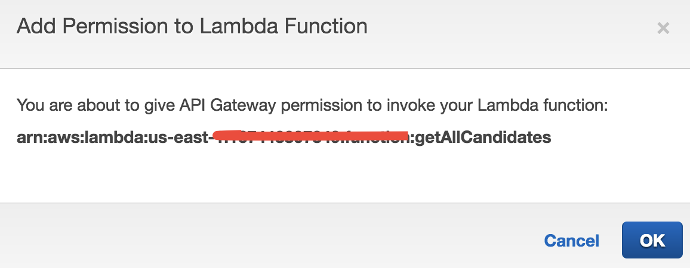

### Step 8: Test the API gateway

Next, we will test API gateway by pressing the ***Test*** link. The response of the function will be shown as below.

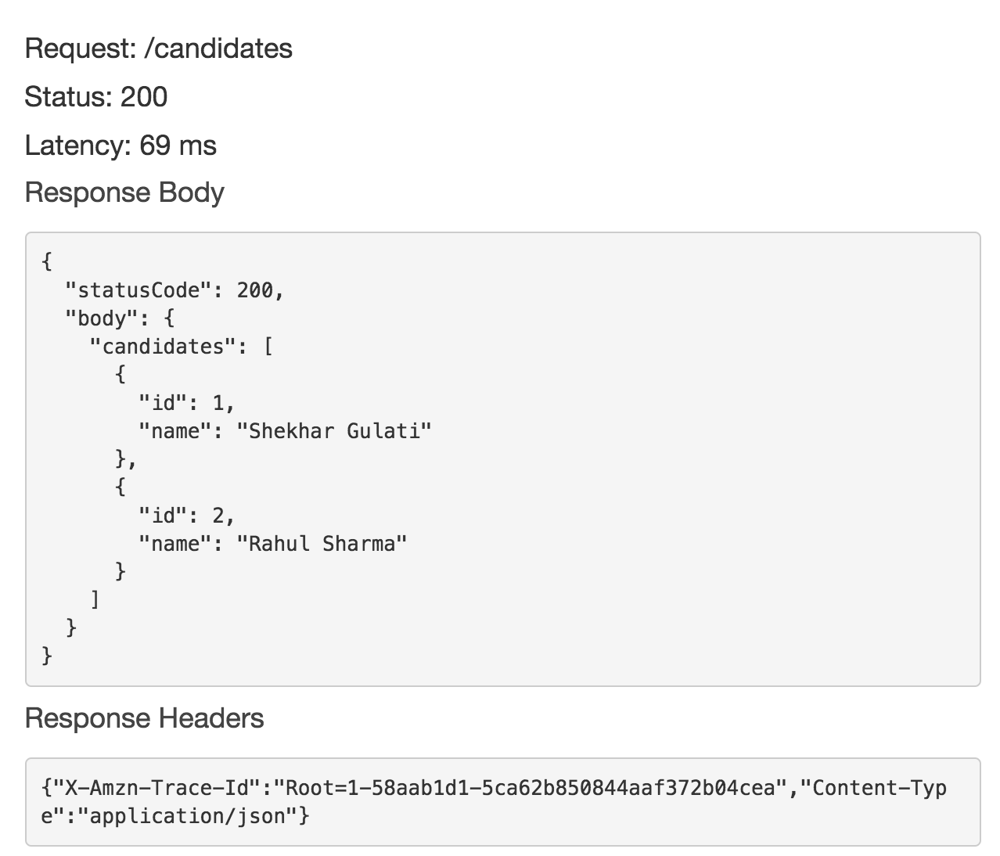

### Step 9: Deploy the API

So far the API is not exposed to the outside world. To expose the API, you have to select ***Deploy API***.

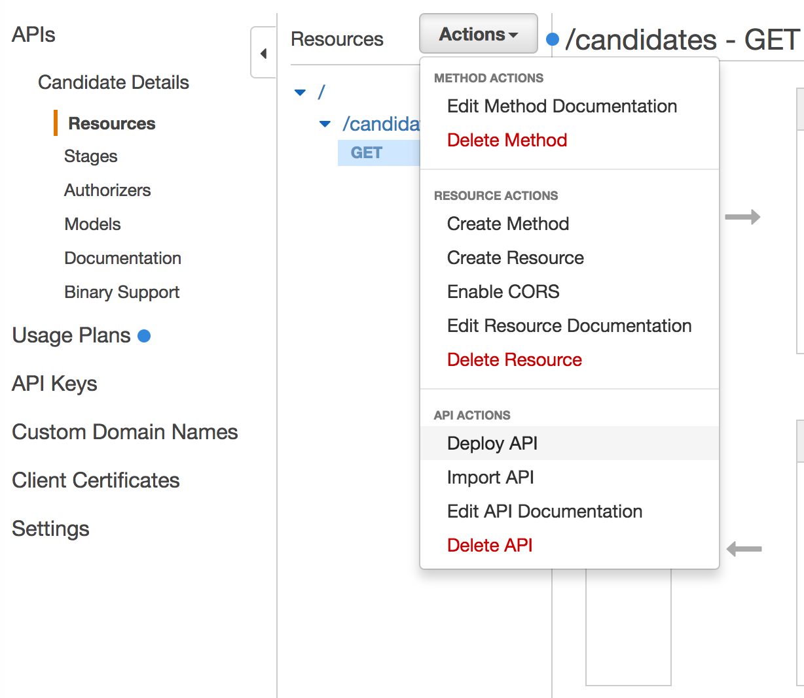

After you press the Deploy API menu item, you will be asked to create a stage. This helps to take your API through different stages like dev, testing, and production. We will create a new `dev` stage and save it. This will give you a URL you can use later. Your API will be accessible at a URL like [https://ibkizie3jc.execute-api.us-east-1.amazonaws.com/dev](https://ibkizie3jc.execute-api.us-east-1.amazonaws.com/dev).

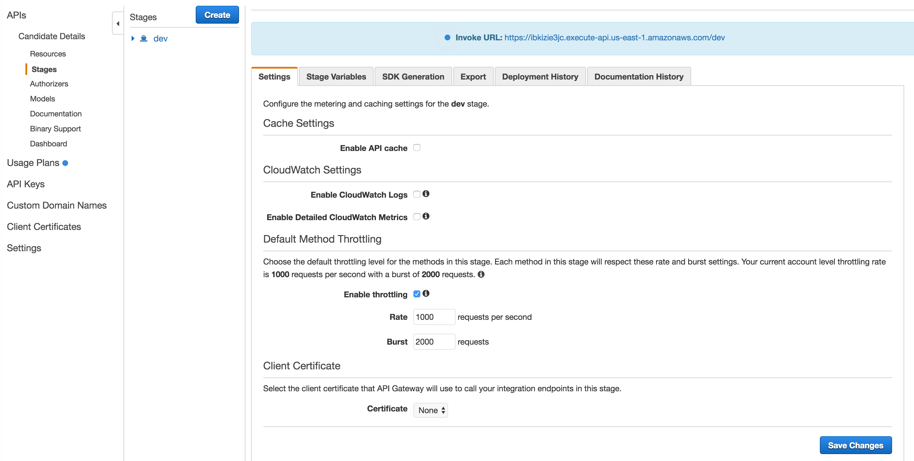

## Conclusion

In this part, we built a REST service using the AWS web console. In the [next part](./03-building-rest-api-in-nodejs-with-lambda-gateway-dynamodb-serverless.md), we will move away from the web console and start building our application using the Serverless framework.
